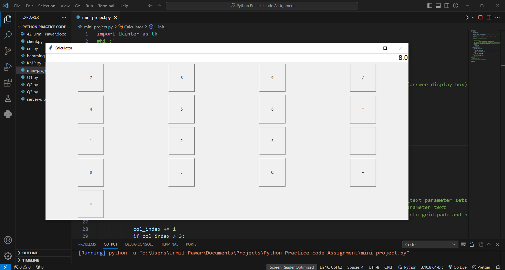

# Calculator using Tkinter
- This mini project is implemented using Tkinter and OOPS concepts.
- The calcuator can perform Operations like addition , multiplication , substraction and division and can even show error if input is not valid.
# Following are the images

